# LGTM.sh Workflow Flowchart

This document contains a Mermaid flowchart that visualizes the complete workflow of the `lgtm.sh` script - a universal Git commit message generator using AI.

## Flowchart

```mermaid
flowchart TD
    A[Start: lgtm.sh] --> B[Parse Command Line Arguments]
    B --> C{Arguments Valid?}
    C -->|No| D[Show Usage & Exit]
    C -->|Yes| E[Validate Requirements]

    E --> F{In Git Repo?}
    F -->|No| G[Error: Not in Git Repository]
    F -->|Yes| H{Required Tools Available?}
    H -->|No| I[Error: Missing Tools]
    H -->|Yes| J{API Config Present?}
    J -->|No| K[Error: Missing API Config]
    J -->|Yes| L[Get Git Diff Output]

    L --> M{Input from STDIN?}
    M -->|Yes| N[Read Diff from STDIN]
    M -->|No| O[Auto-detect Changes]

    O --> P{Staged Changes?}
    P -->|Yes| Q[Use Staged Changes]
    P -->|No| R{Unstaged Changes?}
    R -->|Yes| S[Use Unstaged Changes]
    R -->|No| T[Use Last Commit]

    N --> U[Filter Git Diff]
    Q --> U
    S --> U
    T --> U

    U --> V[Apply File Pattern Filters<br/>📋 Aggregate ignore patterns:<br/>🔸 Environment variables<br/>🔸 CLI flags<br/>🔸 .lgtmignore file<br/>🔸 .gitignore file<br/>🔸 Default patterns<br/>Priority: ENV > CLI > .lgtmignore > .gitignore > defaults]
    V --> W{Files to Process?}
    W -->|No| X[Warning: No Relevant Changes]
    W -->|Yes| Y[Split into Chunks]

    Y --> Z{Content > Max Size?}
    Z -->|No| BB[Use Full Content]
    Z -->|Yes| ZZ{Input Tokens > Max?}
    ZZ -->|Yes| AA[Use First Chunk]
    ZZ -->|No| BB[Use Full Content]

    AA --> CC[Send to AI API]
    BB --> CC

    CC --> DD[Prepare API Request]
    DD --> EE[CURL API Call to AI Model]
    EE --> FF{API Response OK?}
    FF -->|No| GG[Error: API Call Failed]
    FF -->|Yes| HH[Extract Commit Message]

    HH --> II[Clean & Format Message]
    II --> JJ{Mode Check}

    JJ -->|Dry Run| KK[Preview: Show Generated Message]
    JJ -->|Auto Commit| LL[Show Message & Ask Confirmation]
    JJ -->|Normal| MM[Output Message to STDOUT]

    LL --> NN{User Confirms?}
    NN -->|Yes| OO[Stage & Commit Changes]
    NN -->|No| PP[Cancel Commit]

    OO --> QQ{Commit Success?}
    QQ -->|Yes| RR{Auto-Push Enabled?}
    QQ -->|No| SS[Error: Commit Failed]

    RR -->|Yes| TT[Push to Current Branch]
    RR -->|No| UU[Success: Changes Committed]

    TT --> VV{Push Success?}
    VV -->|Yes| WW[Success: Committed & Pushed]
    VV -->|No| XX[Error: Push Failed]

    KK --> YY[End: Preview Complete]
    MM --> ZZ[End: Message Available for Other Tools]
    UU --> AAA[End: Auto-commit Complete]
    WW --> BBB[End: Commit & Push Complete]
    PP --> CCC[End: Commit Cancelled]

    %% Error paths
    D --> DDD[End: Error Exit]
    G --> DDD
    I --> DDD
    K --> DDD
    X --> DDD
    GG --> DDD
    SS --> DDD
    XX --> DDD

    %% Styling
    classDef startEnd fill:#e1f5fe,stroke:#01579b,stroke-width:2px
    classDef process fill:#f3e5f5,stroke:#4a148c,stroke-width:2px
    classDef decision fill:#fff3e0,stroke:#e65100,stroke-width:2px
    classDef error fill:#ffebee,stroke:#c62828,stroke-width:2px
    classDef success fill:#e8f5e8,stroke:#2e7d32,stroke-width:2px

    class A,YY,ZZ,AAA,BBB,CCC startEnd
    class B,E,L,U,V,Y,DD,EE,HH,II,OO,TT process
    class C,F,H,J,M,P,R,W,Z,FF,JJ,NN,QQ,RR,VV decision
    class D,G,I,K,X,GG,SS,XX,DDD error
    class UU,WW success
```

## Workflow Description

The `lgtm.sh` script follows a systematic approach to generate conventional commit messages:

### 1. **Input Processing & Validation**

- Parses command-line arguments (`--dry-run`, `--auto-commit`, `--verbose`, etc.)
- Validates that the script is running in a Git repository
- Checks for required tools (curl, git) and API configuration

### 2. **Git Diff Extraction**

- Supports multiple input sources:
  - STDIN input for piped git diff output
  - Auto-detection of staged changes
  - Fallback to unstaged changes or last commit
- Follows UNIX philosophy by accepting input from other tools

### 3. **Content Filtering & Processing**

- **Pattern Aggregation**: Ignore patterns are collected from multiple sources with priority hierarchy:
  1. **Environment variables** (highest priority) - `LGTM_IGNORE_PATTERNS`
  2. **CLI flags** - `--ignore` parameter
  3. **.lgtmignore file** - Project-specific ignore patterns
  4. **.gitignore file** - Git ignore patterns
  5. **Default patterns** (lowest priority) - Built-in patterns like `*.log`, `node_modules/*`
- Filters by included file extensions (e.g., `.js`, `.py`, `.go`)
- Smart chunking logic:
  - Checks content against `LGTM_MAX_CHUNK_SIZE` character limit
  - Uses model parameters: temperature and top-p (nucleus sampling)
  - Estimates token count and compares against `LGTM_MAX_INPUT_TOKENS`
  - Only chunks content when either limit is exceeded
  - Uses first chunk for large diffs while maintaining context

### 4. **AI API Integration**

- Sends processed diff chunks to configured AI model via CURL with sampling parameters:
  - Temperature (`LGTM_TEMPERATURE`): Controls randomness
  - Top-p (`LGTM_TOP_P`): Nucleus sampling for focused yet diverse responses
- Uses structured prompts for conventional commit format generation
- Handles API responses and error conditions

### 5. **Output & Commit Options**

- **Dry-run mode**: Previews generated message without changes
- **Auto-commit mode**: Prompts for confirmation before committing
- **Auto-push mode**: Automatically pushes to current branch after successful commit
- **Normal mode**: Outputs message to STDOUT for use by other tools
- Maintains UNIX philosophy by providing clean, pipeable output

### Key Features

- **Configurable**: Environment variables control behavior
- **Portable**: Compatible with Linux and macOS
- **Robust**: Comprehensive error handling and validation
- **Flexible**: Multiple input/output modes for different workflows
- **Standards-compliant**: Generates conventional commit messages
- **Smart Filtering**: Multi-source ignore pattern support with .lgtmignore integration
- **Git Integration**: Auto-commit and auto-push functionality for streamlined workflows
